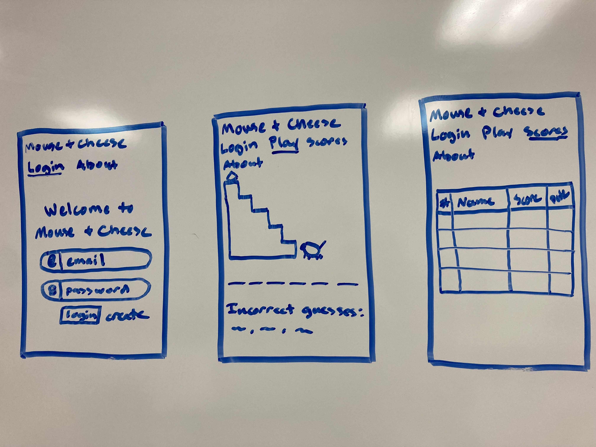
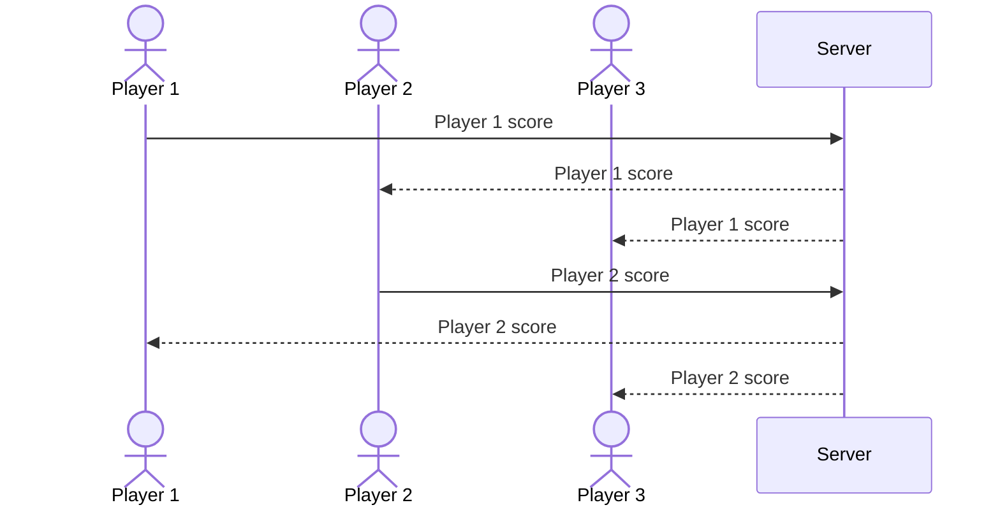

# Hang Cheese

[My Notes](notes.md)

A brief description of the application here: This application will be a simplified version of the game hangman, presented through the lense of a mouse going after cheese. It will allow users to log in, play the game, and keep thrack of their's and other's best scores (in this case the lowest score).

> [!NOTE]
>  This is a template for your startup application. You must modify this `README.md` file for each phase of your development. You only need to fill in the section for each deliverable when that deliverable is submitted in Canvas. Without completing the section for a deliverable, the TA will not know what to look for when grading your submission. Feel free to add additional information to each deliverable description, but make sure you at least have the list of rubric items and a description of what you did for each item.

> [!NOTE]
>  If you are not familiar with Markdown then you should review the [documentation](https://docs.github.com/en/get-started/writing-on-github/getting-started-with-writing-and-formatting-on-github/basic-writing-and-formatting-syntax) before continuing.

## 🚀 Specification Deliverable

> [!NOTE]
>  Fill in this sections as the submission artifact for this deliverable. You can refer to this [example](https://github.com/webprogramming260/startup-example/blob/main/README.md) for inspiration.

For this deliverable I did the following. I checked the box `[x]` and added a description for things I completed.

- [x] Proper use of Markdown
- [x] A concise and compelling elevator pitch
- [x] Description of key features
- [x] Description of how you will use each technology
- [x] One or more rough sketches of your application. Images must be embedded in this file using Markdown image references.

### Elevator pitch

Have you ever wanted to play a game of hangman but lack the space to do it? This app will be the perfect thing for you! Enjoy a version of hangman that instead has a mouse going after a piece of cheese. Guess the word before the cheese gets got. This app will allow you to log into an account to save your scores, play a game of hangman with a 6 letter word, and compare your scores with friends and other users. 

### Design

Here is a sequence diagram that shows how player scores will interact with the backend in order to be viewed by others.

### Key features

- Secure login on HTTPS
- Randomly selected words for game
- Input of player guesses
- Updating graphic based on input
- Scores calculated and saved for other users to see

### Technologies

I am going to use the required technologies in the following ways.

- **HTML** - Uses html to structure pages. Four html pages for login, play, scores and about the web application. Hyperlinks between each page.
- **CSS** - Styling of application that looks good on multiple web sizes. Good use of whitespace, color, contrast and updating images.
- **React** - Login, guess inputs, display of correct and incorrect guesses, and use of React for routing and components.
- **Service** - Backend for:
    - login
    - random word generation
    - recieving and submitting guesses
    - submitting scores
- **DB/Login** - Store users and scores in database. Register and login users. Credientals stored in secure database and cannot play unless logged in.
- **WebSocket** - High score of each player updates for all others.

## 🚀 AWS deliverable

For this deliverable I did the following. I checked the box `[x]` and added a description for things I completed.

- [x] **Server deployed and accessible with custom domain name** - [Hang Cheese](https://hangcheese.click).

## 🚀 HTML deliverable

For this deliverable I did the following. I checked the box `[x]` and added a description for things I completed.

- [x] **HTML pages** - I have four html pages: index, game, scoreboard and info. They are all linked to each other.
- [x] **Proper HTML element usage** - Each html page properly uses the following tags: body, nav, main, header, and footer.
- [x] **Links** - Each html page contains a link to each other page as well as my github repository.
- [x] **Text** - There is sufficient text to explain the game and acting as placholders for other technologies.
- [x] **3rd party API placeholder** - If I can get it to work, the word the player is trying to guess will be randomly selected by a third party API, otherwise it will be a quote or image on the about page.
- [x] **Images** - There is a game image that will be able to update once new technologies are intorduced on the game page, and one other image on the about page. There is also an icon for the browser tab.
- [x] **Login placeholder** - There are input boxes for an email and password on the starting page, as well as a submit button for both login and to create an account.
- [x] **DB data placeholder** - On the game page, there is a spot where live updates will be made avaliable to players and the scoreboard also reflects the current standings accourding to the database.
- [x] **WebSocket placeholder** - On the game page, there is a spot where live updates will be made avaliable to players.

## 🚀 CSS deliverable

For this deliverable I did the following. I checked the box `[x]` and added a description for things I completed.

- [x] **Header, footer, and main content body** - Header, footer and main css code found on main.css and then overwritten as needed.
- [x] **Navigation elements** - Navigation bar is the same across all 4 pages using bootstrap.
- [x] **Responsive to window resizing** - All elements on all pages should be accessable whatever the window size.
- [x] **Application elements** - All buttons and input boxes are styled and functional.
- [x] **Application text content** - All text elements are styled and responsive.
- [x] **Application images** - All images are styled and responsive.

## 🚀 React part 1: Routing deliverable

For this deliverable I did the following. I checked the box `[x]` and added a description for things I completed.

- [x] **Bundled using Vite** - I installed Vite and used it to rewrite my website in React.
- [x] **Components** - All of my html/css pages are wrapped up in React components.
- [x] **Router** - The nav bar is able to route between different pages on the website.

## 🚀 React part 2: Reactivity

For this deliverable I did the following. I checked the box `[x]` and added a description for things I completed.

- [x] **All functionality implemented or mocked out** - All parts of the app function as intened, with placeholders for DB and websocket. You can login, play the game, save scores, and see games events from other players.
- [x] **Hooks** - React hooks are used throughout the app in order for reactivity to work.

## 🚀 Service deliverable

For this deliverable I did the following. I checked the box `[x]` and added a description for things I completed.

- [ ] **Node.js/Express HTTP service** - I did not complete this part of the deliverable.
- [ ] **Static middleware for frontend** - I did not complete this part of the deliverable.
- [ ] **Calls to third party endpoints** - I did not complete this part of the deliverable.
- [ ] **Backend service endpoints** - I did not complete this part of the deliverable.
- [ ] **Frontend calls service endpoints** - I did not complete this part of the deliverable.

## 🚀 DB/Login deliverable

For this deliverable I did the following. I checked the box `[x]` and added a description for things I completed.

- [ ] **User registration** - I did not complete this part of the deliverable.
- [ ] **User login and logout** - I did not complete this part of the deliverable.
- [ ] **Stores data in MongoDB** - I did not complete this part of the deliverable.
- [ ] **Stores credentials in MongoDB** - I did not complete this part of the deliverable.
- [ ] **Restricts functionality based on authentication** - I did not complete this part of the deliverable.

## 🚀 WebSocket deliverable

For this deliverable I did the following. I checked the box `[x]` and added a description for things I completed.

- [ ] **Backend listens for WebSocket connection** - I did not complete this part of the deliverable.
- [ ] **Frontend makes WebSocket connection** - I did not complete this part of the deliverable.
- [ ] **Data sent over WebSocket connection** - I did not complete this part of the deliverable.
- [ ] **WebSocket data displayed** - I did not complete this part of the deliverable.
- [ ] **Application is fully functional** - I did not complete this part of the deliverable.
